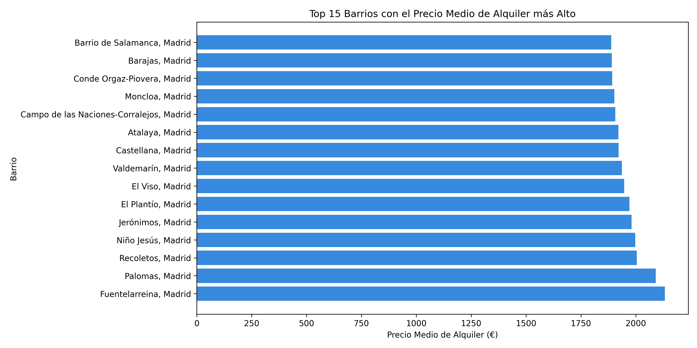
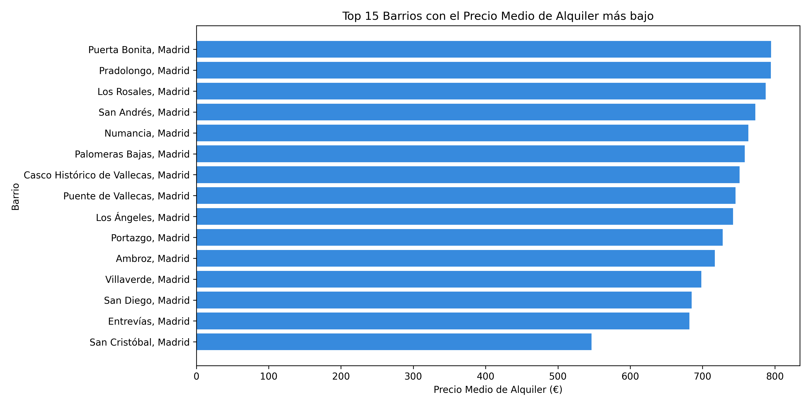
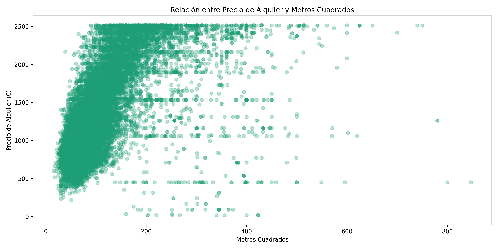
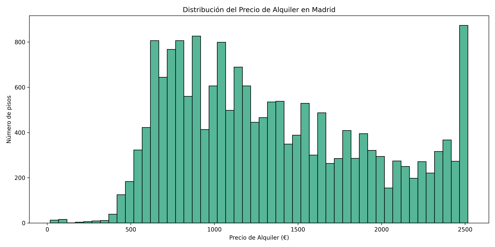
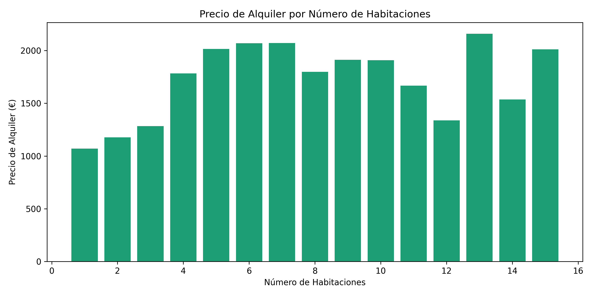
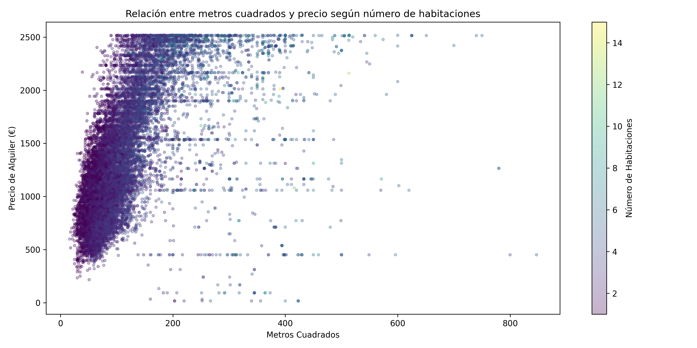

# Predictor de alquiler en Madrid

Predictor de alquileres en Madrid desarrollado con Python y Streamlit.
Permite filtrar los datos por habitaciones, metros y barrio de forma interactiva.

## Demo en vivo
[Ver dashboard](https://predictor-alquiler-madrid-ls2ymwjtmwm5cn6meve2ix.streamlit.app)

## Tecnologías
- Python
- pandas
- matplotlib
- seaborn
- Streamlit
- Sklearn

## Funcionalidades
- Filtros interactivos por barrio metros cuadrados y habitaciones
- Métricas principales: barrio, habitaciones, metros cuadrados y precio por metros cuadrados
- Gráfica de barras horizontal de barrios más caros
- Gráfica de barras horizontal de barrios más baratos
- Dispersión de metros cuadrados y precio coloreada por número de habitaciones
- Gráfica de barras del precio de alquiler por número de habitaciones
- Gráfica de barras de la distribución del precio de alquiler
- Gráfico de dispersión para visualizar la relación entre el precio de alquiler y los metros cuadrados

## Visualizaciones

### Parte 1

### Parte 2

### Parte 3

### Parte 4

### Parte 5

### Parte 6

## Cómo ejecutarlo en local
1. Clona el repositorio
2. Instala las dependencias: `pip install -r requirements.txt`
3. Ejecuta: `streamlit run app.py`